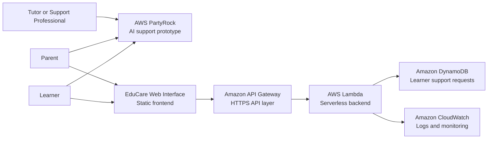
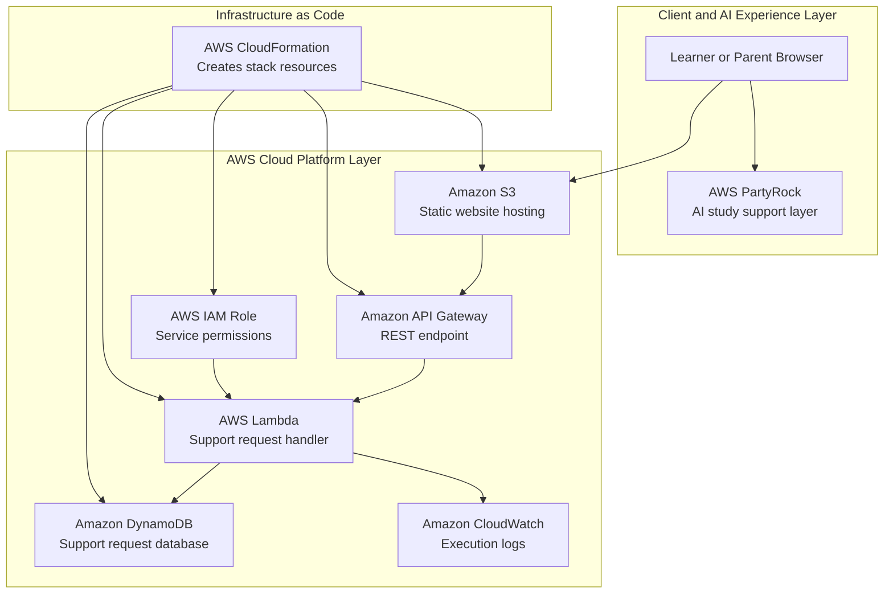
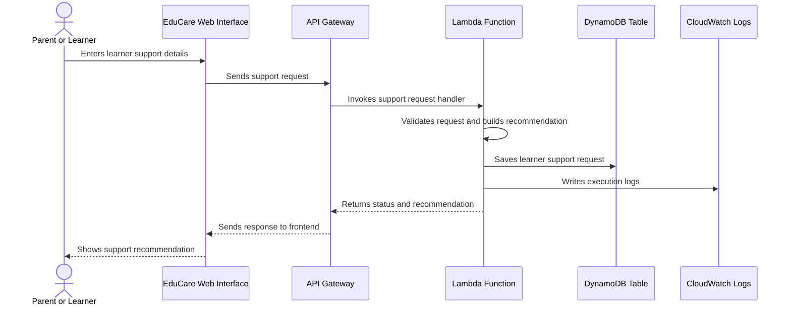
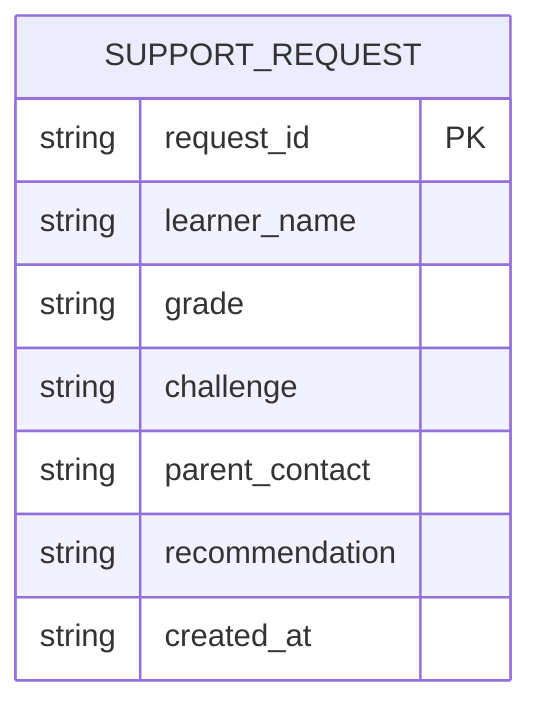
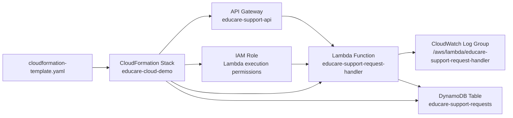
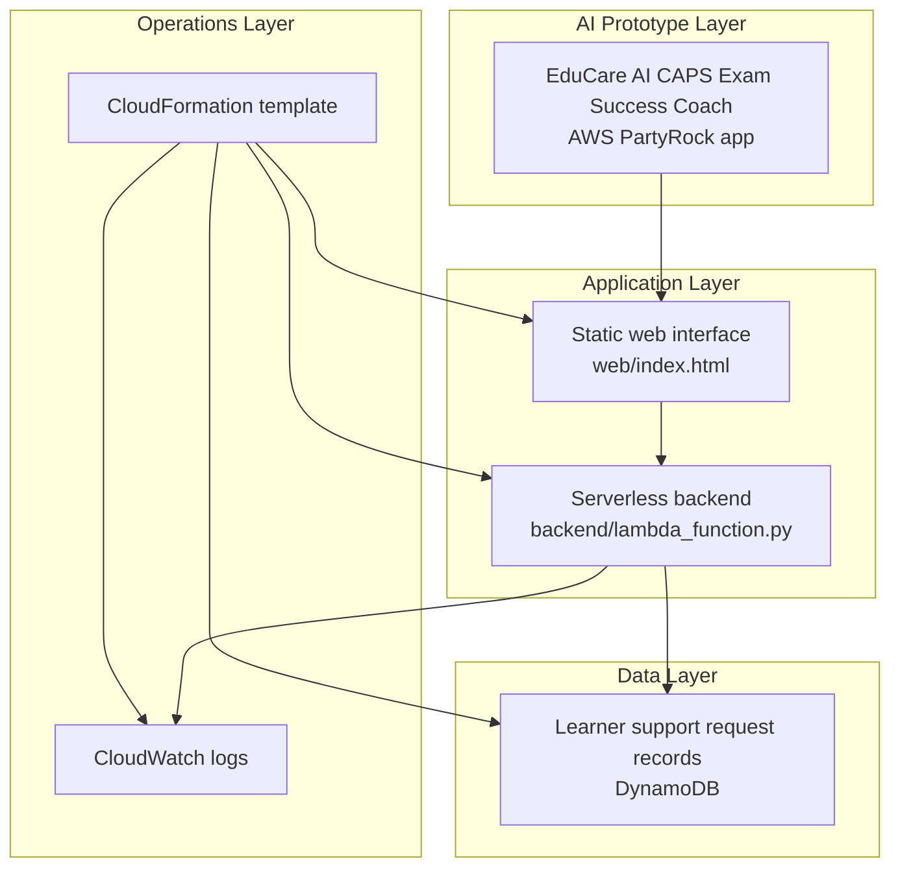

# AWS EduCare Cloud Support Platform Architecture

## Project name

AWS EduCare Cloud Support Platform

## Purpose

EduCare is an education support platform that combines an AI learner support prototype with an AWS cloud backend.

The original prototype used AWS PartyRock for generative AI learner support. The upgraded architecture adds a cloud platform layer with serverless processing, managed data storage, API access, monitoring and infrastructure as code.

The goal is to show how a learner support idea can grow from an AI prototype into a cloud based system that can support parents, learners, tutors and education support teams.

---

## 1. System context diagram

This diagram shows the main users and cloud services involved in the system.



---

## 2. Cloud architecture diagram

This diagram shows the cloud platform layer and how each AWS service fits into the solution.



---

## 3. Request processing sequence diagram

This UML sequence diagram explains what happens when a learner support request is processed.



---

## 4. Data model diagram

This diagram shows the current DynamoDB item structure used to store learner support requests.



---

## 5. Infrastructure as Code resource map

This diagram shows the resources created by the CloudFormation template.



---

## 6. Logical component view

This diagram separates the system into clear responsibility areas.



---

## 7. Current AWS implementation

The current AWS implementation has been deployed in the Europe Stockholm region.

```text
CloudFormation stack: educare-cloud-demo
Region: Europe Stockholm eu-north-1
DynamoDB table: educare-support-requests
Lambda function: educare-support-request-handler
API Gateway: educare-support-api
CloudWatch log group: /aws/lambda/educare-support-request-handler
```

The Lambda function was tested with a learner support request. The request was processed successfully and stored in the DynamoDB table.

---

## 8. AWS services used

| AWS service | System role | Reason for use |
|---|---|---|
| AWS PartyRock | AI support prototype | Fast AI app creation for study support and intervention guidance |
| Amazon S3 | Static frontend hosting | Hosts a lightweight web interface without managing servers |
| Amazon API Gateway | API layer | Provides an HTTPS endpoint between the frontend and backend |
| AWS Lambda | Serverless backend | Processes support requests only when invoked |
| Amazon DynamoDB | Managed database | Stores learner support request items without managing database servers |
| Amazon CloudWatch | Monitoring | Stores Lambda execution logs and supports troubleshooting |
| AWS IAM | Permissions | Allows services to access only what they need |
| AWS CloudFormation | Infrastructure as code | Recreates the stack from a template |

---

## 9. Why serverless

Serverless is a good fit for this project because:

* there is no server to manage
* Lambda only runs when a request is made
* DynamoDB is managed by AWS
* CloudWatch gives automatic logs
* CloudFormation makes the cloud setup repeatable
* the project can start small and scale later

---

## 10. Production improvements

A production version can add:

* Amazon Cognito for parent, learner and tutor login
* CloudFront in front of S3 for content delivery
* Amazon Bedrock for production AI integration
* stricter IAM least privilege permissions
* API Gateway connected directly to the frontend form
* dashboards for learner intervention trends
* CI CD deployment with GitHub Actions
