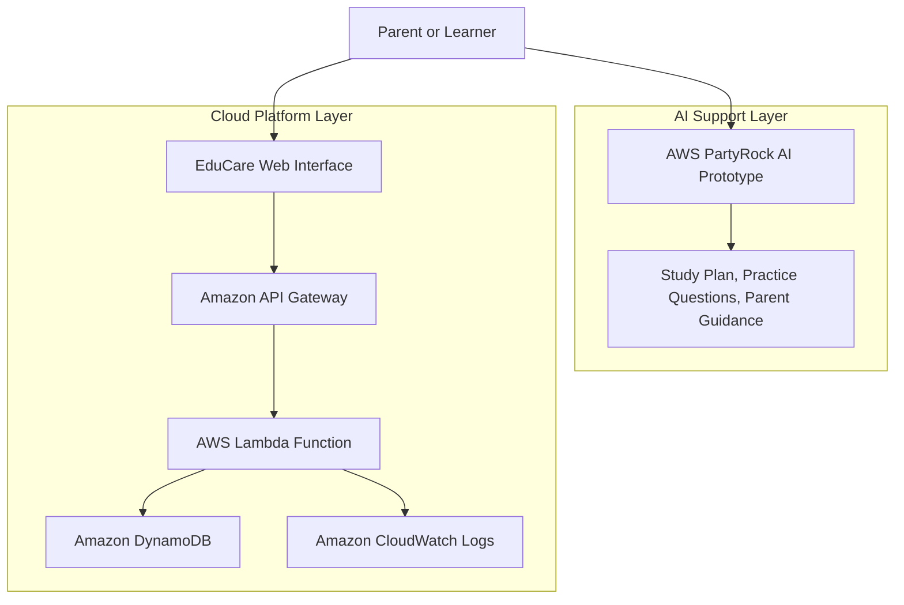
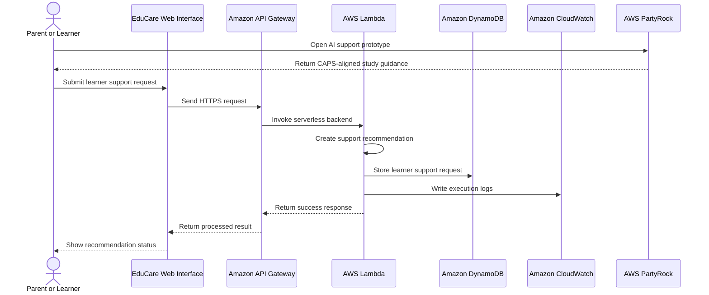
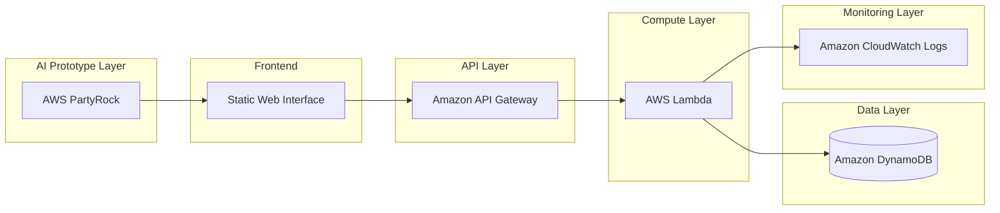
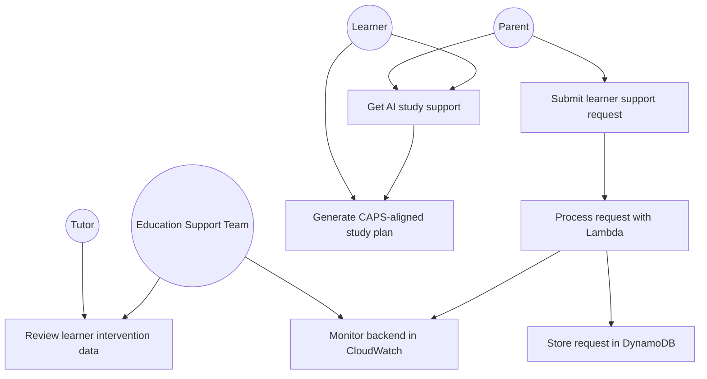
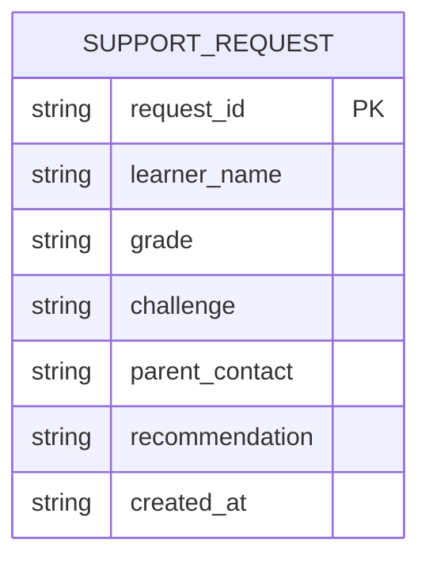
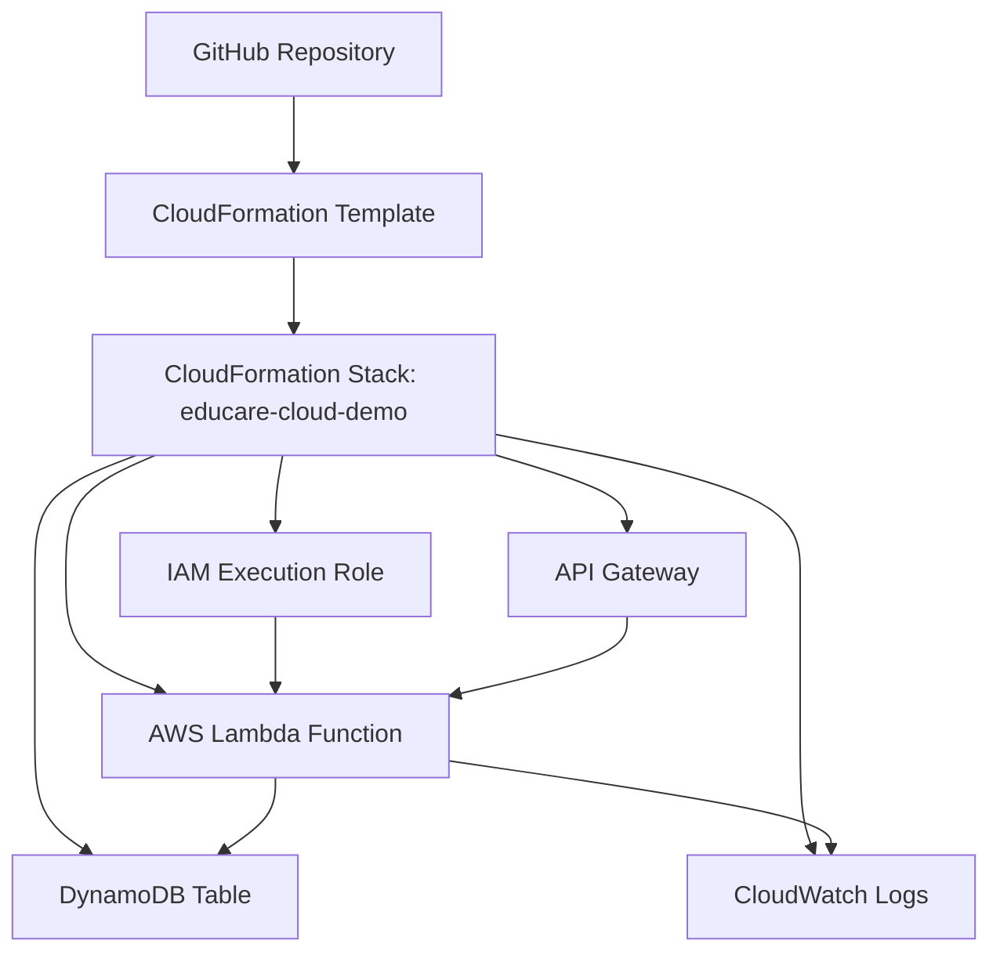

# EduCare Cloud Architecture Diagrams

This document explains the EduCare Cloud Support Platform using professional architecture and UML-style diagrams.

The diagrams show how the AI prototype layer, web interface, API layer, serverless backend, database and monitoring services connect together.

---

## 1. High level system architecture

---

## 2. Request processing sequence

---

## 3. Cloud component diagram

---

## 4. UML-style use case diagram

---

## 5. Data model

---

## 6. Deployment and infrastructure view

---

## 7. System explanation

EduCare has two main layers:

1. **AI support layer**  
   AWS PartyRock is used to prototype the learner support experience. It generates CAPS-aligned study plans, revision support, practice questions and parent guidance.

2. **Cloud platform layer**  
   AWS services are used to process and store learner support requests. API Gateway exposes the API, Lambda processes requests, DynamoDB stores data and CloudWatch records logs.

This structure shows how an AI education idea can grow into a proper AWS cloud architecture.
